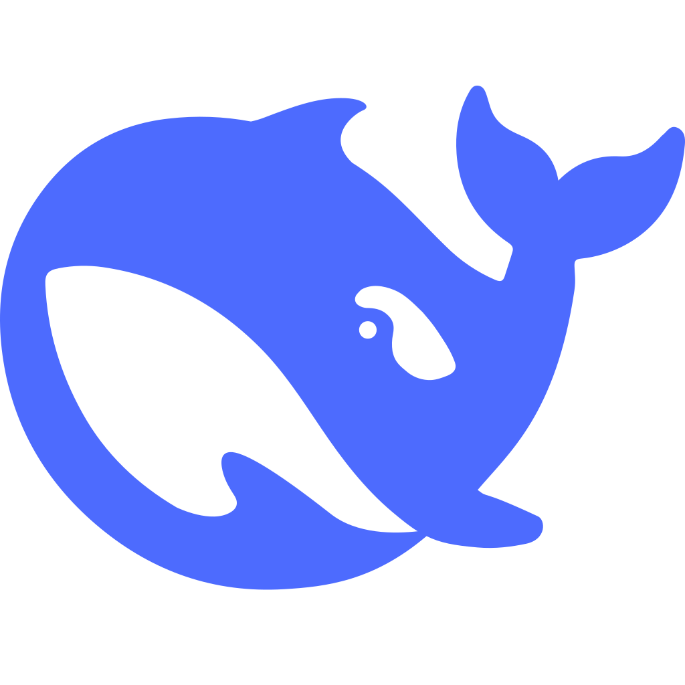
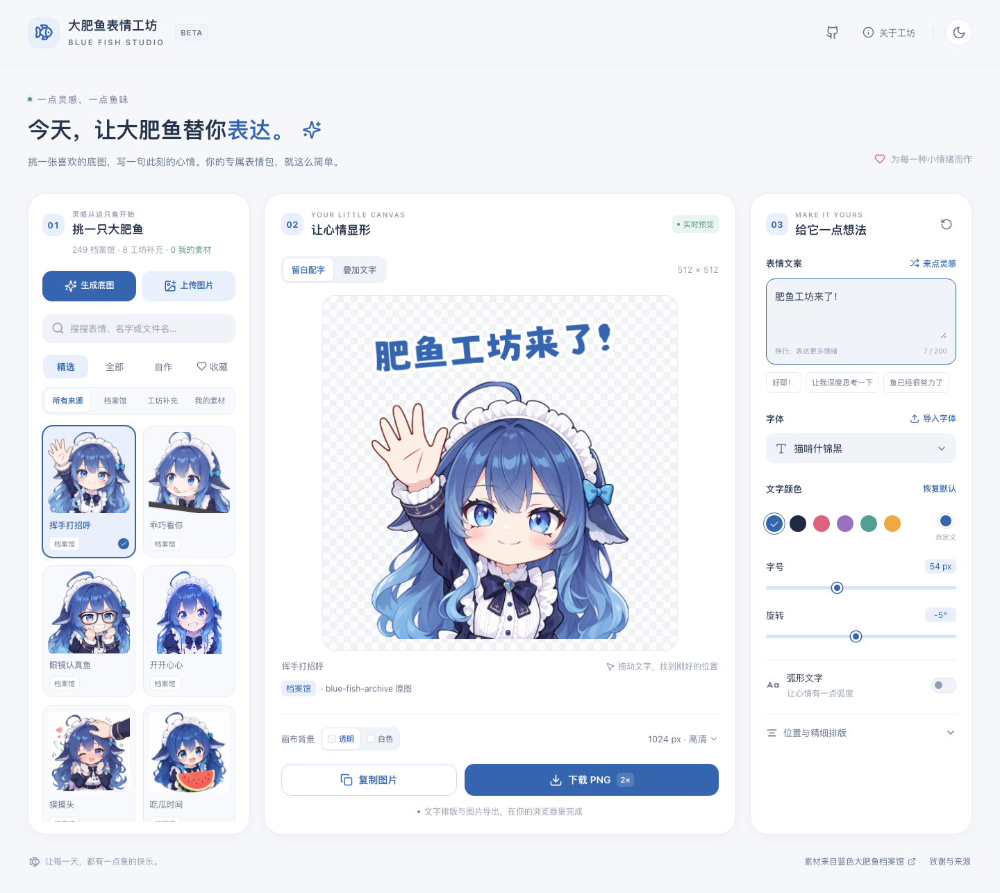
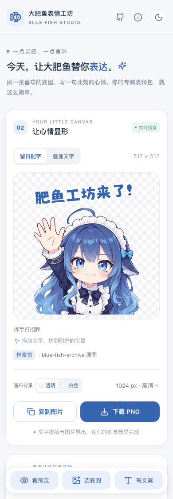

<h1 align="center">大肥鱼表情工坊 · Blue Fish Studio</h1>

<p align="center">
  
  
</p>

<p align="center">以 DeepSeek 鲸鱼娘为主角，在浏览器里选底图、写文案、制作表情包。</p>

<p align="center">
  <a href="https://eynnzerr.github.io/blue-fish-studio/"><strong>打开大肥鱼表情工坊 →</strong></a>
</p>

## 界面预览



<details>
  <summary>查看手机端</summary>
  <p align="center">
    
  </p>
</details>

## 功能

- **选底图**：档案馆素材与工坊补充按来源分别浏览；支持名称、文件名和标签搜索，自作分类、本机收藏及本地图片导入。
- **生成底图**：填写 OpenAI 兼容服务的 Base URL、模型名称、API Key 和提示词，预览后放入「我的素材」继续配字，也可直接下载底图。
- **写文案**：多行文字、推荐文案、随机灵感；内置猫啃什锦黑、站酷快乐体、站酷庆科黄油体、马善政毛笔手写与系统字体，可导入 TTF、OTF、WOFF、WOFF2。
- **调排版**：画布点击或拖动定位，调整字号、颜色、描边、旋转、行距、字距和弧形文字；一键恢复初始设置。
- **裁剪底图**：拖动选框和边角，按自由、原图、1:1、4:3、3:4 比例截取局部；支持触摸和键盘微调，可恢复完整底图。
- **看效果**：留白配字与叠加文字两种布局，透明或白色画布，实时预览，浅色与深色主题。
- **画布与导出**：正方形、跟随底图或裁剪比例、自定义宽高；复制或下载长边 512、1024、1536 px PNG，也可自定义 1–4096 px 宽高，默认锁定比例。
- **全站统计**：页脚居中显示累计访问与累计导出次数，统计服务使用 SQLite 持久化。配置与本地联调见 [统计说明](docs/statistics.md)。

## 使用

选择底图、输入文字、调整样式，然后复制或下载。「我的素材」收纳本次页面中上传、生成的图片，刷新页面后清除，请下载需要保留的作品。导入字体同样仅用于当前页面，收藏保存在浏览器本地。

内置字体在首次选中时加载。复制图片需要浏览器支持 Clipboard API，并在 HTTPS 或 `localhost` 下使用。GIF 以首帧合成，输出为 PNG；透明画布会保留底图自身的白色像素，工坊补充提供 8 张透明底素材。

### 裁剪与尺寸

点击预览区的「裁剪底图」，选择比例并拖动选区，点击「应用裁剪」后继续配字。「重新裁剪」始终打开完整原图，「恢复底图」移除当前裁剪。每张素材的裁剪区域在当前页面内分别保留，刷新后清除；右侧的排版重置仅恢复文字与布局设置。

「画布比例」选择「跟随底图 / 裁剪比例」即可制作横图或竖图；「留白配字」仍会为文字保留空间，选择「叠加文字」可让同等比例的底图铺满画布。导出预设以最长边为准，另一边按比例计算。

选择「自定义宽高」后可输入像素尺寸，宽高均为 1–4096 的整数。锁定比例时修改任意一边会自动计算另一边；解除锁定后，修改宽高会同步改变画布形状，图片保持等比例放置，预览与导出使用相同构图。裁剪、排版和 PNG 导出均在浏览器中完成。

## 本地运行

项目使用 React、Vite 和 TypeScript，图片与文字在浏览器内合成。

环境要求：Node.js 20.19+ 或 22.12+，npm。

```sh
npm install
npm run dev
```

打开终端显示的本地地址即可。

统计默认通过开发服务器代理到 `http://127.0.0.1:8787` 的 API 服务；可在 `.env.development.local` 中设置 `STATS_PROXY_TARGET` 调整地址。服务端使用 Node.js 22.13+，也可直接运行 Docker Compose。

## 使用自己的图像生成服务

点击素材栏的「生成底图」，填写服务商提供的 Base URL、图像模型名称、API Key 和 Prompt。Base URL 应包含所需路径前缀，例如 `https://api.openai.com/v1`，网页会追加 `/images/generations`；也可填写完整的生成接口地址。模型名称使用服务商提供的模型 ID。

服务需支持同步的 [OpenAI Images API](https://developers.openai.com/api/reference/resources/images/methods/generate)，每次生成一张图，返回 `data[0].b64_json` 或 `data[0].url`。默认省略尺寸与背景参数，可按模型能力选择尺寸或透明输出；透明输出发送 `background: "transparent"` 和 `output_format: "png"`。Chat Completions、Responses 和异步任务接口属于其他协议。

API Key 仅保存在当前页面内存中，刷新即清除。浏览器将提示词与 Key 直接发送到填写的服务，服务需允许当前网站来源的 CORS 请求；远程图片地址也需允许跨域下载，下载图片不携带 Key。公网接口使用 HTTPS，本机接口支持 HTTP。在线站点的来源为 `https://eynnzerr.github.io`。

预览满意后，点击「使用这张底图」加入「我的素材」继续配字，或直接下载底图。服务商按其规则计费；停止等待或关闭弹窗会中断浏览器请求，服务端可能已经开始生成。

## 服务接口

也可将表情合成作为 HTTP 服务运行：提交底图 ID、文案和样式，直接获取 PNG，供 AstrBot 等程序调用。启动、Docker 部署与请求示例见 [接口文档](docs/api.md)。

配套的 [肥鱼工坊 AstrBot 插件](https://github.com/Eynnzerr/astrbot_plugin_blue_fish) 将制图能力接入 QQ 聊天：查询底图和字体后，通过 `/肥鱼` 命令填写文案、选择样式，插件调用工坊 API 并回复生成的 PNG 图片。

## 构建与部署

```sh
npm run build
npm run preview
```

将 `dist/` 完整部署到静态托管服务即可。项目采用相对资源路径，支持根目录或 `/blue-fish-studio/` 等子目录部署，子目录入口保留末尾 `/`。生产环境使用 HTTPS。

本仓库推送到 `main` 后，由 [GitHub Actions](https://github.com/Eynnzerr/blue-fish-studio/actions/workflows/pages.yml) 自动构建并发布到 GitHub Pages。Fork 后，在 **Settings → Pages → Source** 中选择 **GitHub Actions**，再手动运行「Deploy GitHub Pages」工作流。

## 版权与致谢

- **素材**：感谢鲸鱼娘角色原作者上善无形、二次设计作者 ZipZipPipe，以及 [EDMOK / blue-fish-archive](https://github.com/EDMOK/blue-fish-archive) 的整理与各位素材创作者。
- **功能与设计**：感谢 [Moesekai](https://github.com/StarMoe-org/Moesekai) 表情包制作器提供创作功能与 Material 3 风格参考。
- **字体**：感谢猫啃什锦黑、站酷快乐体、站酷庆科黄油体、马善政毛笔手写的作者与贡献者。

角色与图片相关权利归原作者，具体署名与授权范围见 [ASSET_SOURCES.md](ASSET_SOURCES.md)；第三方项目、字体和依赖的许可见 [THIRD_PARTY_NOTICES.md](THIRD_PARTY_NOTICES.md)。本项目自有源码的许可证尚未指定。
